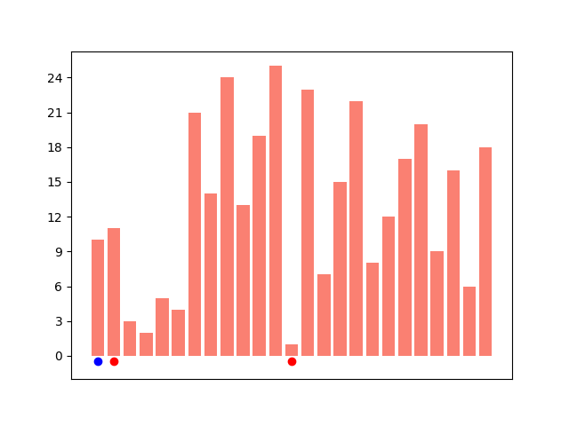
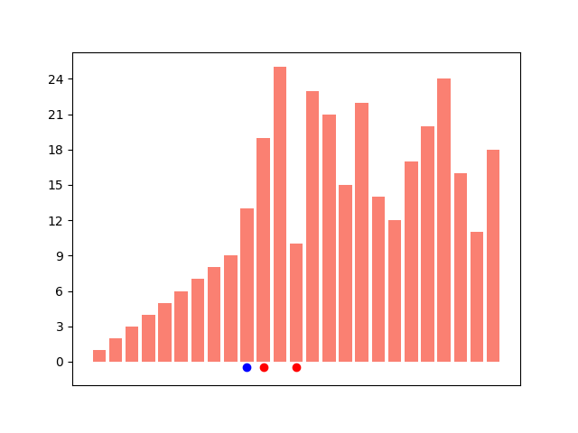
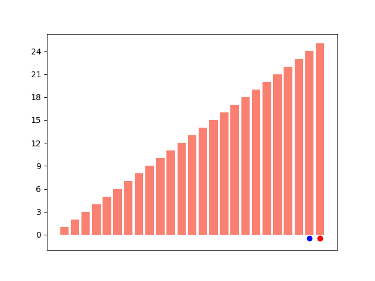

#### Animations

I was thinking about sorting algorithms and I decided to write a script to make an animation to show how an algorithm works.

There's no reason not do this in Python, and as always when dealing with graphics we're going to use matplotlib, at least for the first part.

Although there is ``matplotlib.animation``, I decided to write the images individually to a folder and then assemble them with imagemagick.  I've never used either one.

#### imagemagick

I found [this](https://stackoverflow.com/questions/6230353/how-to-create-gif-animation-from-a-stack-of-jpgs)

```
convert -delay 20 -loop 0 *.jpg animated.gif
```

You can see the basic idea:  ``convert`` is a binary that comes with imagemagick, ``-delay`` is the time each image is displayed, ``-loop 0`` means loop forever, and then a list of filenames followed by the output filename.

It has quite a few dependencies, as you can see with

```
brew deps imagemagick
```

nevertheless, I  installed it.

#### Selection sort

Selection sort maintains an index with an invariant:  everything to the left of that position is in sorted order, with the smallest element at the left.

I wrote it as a generator:

```python
def selection_sort(L):
    # next lowest value starting from current position
    def next_index(start=0):
        v = min(L[start:])
        return L.index(v)
    target = sorted(L)
    i = 0
    while L != target:
        j = next_index(start=i)
        # swap
        L[i],L[j] = L[j],L[i]
        yield (i,j,L)
        i += 1
```

We cheat a bit by simply running the algorithm until the result is equal to that returned by ``sorted``.

The purpose of yielding the two indices is to allow plotting markers for them.

In this version we just generate all the ints from 1 to the value passed into Python.  25 works well.
d
#### Drawing

The drawing code is in a secon module.  It is essentially just a call to 

```
matplotlib.pyplot.bar(R, L, color= 'salmon')
```

The x-positions are in ``R`` and the y-values in ``L``.  Here is the part except for the file save.

```python
def barplot(L,markers=[]):
    global count
    count += 1
    plt.figure()
    frame = plt.gca()
    frame.axes.get_xaxis().set_visible(False)
    frame.yaxis.set_major_locator(
        MaxNLocator(integer=True))

    R = range(len(L))
    plt.bar(R, L, color= 'salmon')
    if markers:
        do(markers)
```

It's important to close the figure, because by default it stays in memory.  That is done in the main script with ``plt.close()``.

Here are the listings for [``selection.py``](selection.py) and [``helper.py``](helper.py).

And here is the first frame.



#### Putting it all together

I wrote a shell script to manage things.  Here it is:

```
#! /bin/bash

rm tmp/*
last=$(python selection.py $1)
echo $last
convert -delay 75 -loop 3 tmp/*.png -delay 250 $last animated.gif
open -a Safari animated.gif
```

It was a challenge to find a way to capture the last filename and treat it specially.  We add a longer delay at the end.

Safari shows the animation fine, although I haven't found a way to stop it.  However, one can just page through the files in ``tmp`` and see all the individual frames.

Here is one from the middle:



and the last one:

