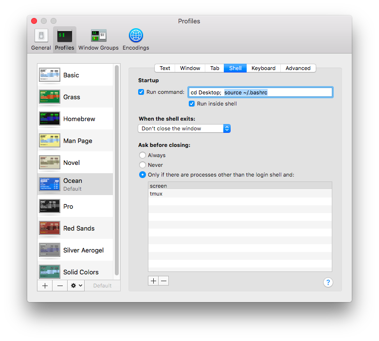

#### autoenv

```
pip install autoenv==1.0.0
```

[repo](https://github.com/kennethreitz/autoenv)

``autoenv`` can be set so that a virtual environment is activated automatically when you ``cd`` into a directory.

The way it works is you put an ``.env`` file in that directory which is executed automatically by the bash shell upon entry:

```
source env/bin/activate
```

You can even set per-folder environmental variables:

```
export APP_SETTINGS="config.DevelopmentConfig"
```

The flask-by-example [tutorial](https://realpython.com/blog/python/flask-by-example-part-1-project-setup/) says to do

```
> echo "source `which activate.sh`" >> ~/.bashrc
> source ~/.bashrc
```

The first line adds ``which activate.sh`` to ``~/.bashrc``.  This executes a shell script

```
> which activate.sh
/usr/local/bin/activate.sh
> head -n 5 /usr/local/bin/activate.sh
#!/usr/bin/env bash
AUTOENV_AUTH_FILE=~/.autoenv_authorized

if [[ -n "${ZSH_VERSION}" ]]
then __array_offset=0
> 
```

which makes the whole thing work.

I had some trouble with this so I jus put the command ``activate.sh`` in my Terminal Preferences.



